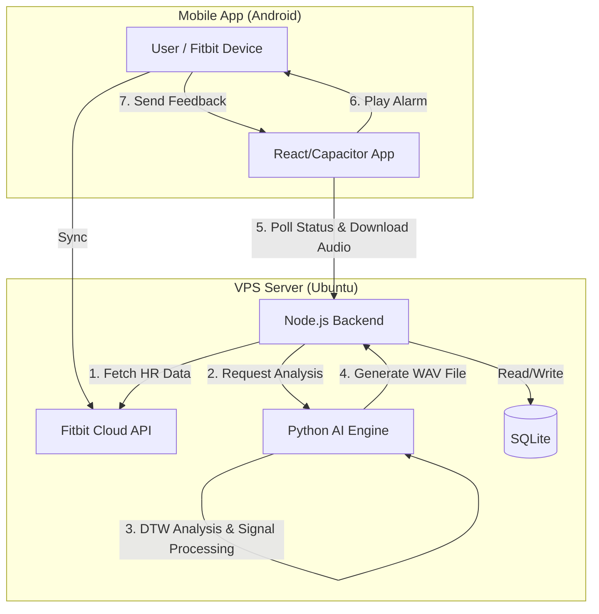

# Mixync (BioMixer)
**AI-Powered Adaptive Awakening Support System**
**生体データに基づく適応的起床支援システム**

-339933?style=flat-square&logo=node.js)
-3776AB?style=flat-square&logo=python)

---

## 📖 Overview / 概要

**"No more groggy mornings."**

Mixync is a smart alarm application designed to solve **Sleep Inertia** (the feeling of grogginess upon waking). Unlike traditional alarms that play a static sound, Mixync analyzes the user's **Heart Rate (HR) and Sleep Stage** in real-time via Fitbit integration.

The system uses **AI (DTW Algorithm)** to dynamically generate a custom audio track—applying specific effects like Tremolo or Reverb—that best matches the user's current physiological state to induce a refreshing awakening.

**「もう、不快な目覚めは繰り返さない。」**

Mixyncは、**睡眠慣性（Sleep Inertia）** の解消を目指して開発されたスマートアラームです。従来の固定音のアラームとは異なり、Fitbitから取得した**リアルタイムの心拍数・睡眠深度**を解析します。
その日の自律神経の状態に合わせて、AIが**最適な音響エフェクト（トレモロ、リバーブ等）を動的に生成・合成**することで、脳を自然に覚醒状態へと導きます。

---

## 🚀 Key Features / 主な機能

### 1. Adaptive Sound Synthesis (適応的サウンド生成)
*   **Dynamic Audio Engine:** The backend Python engine modifies the raw alarm sound using DSP (Digital Signal Processing).
*   **5 Distinct Patterns:**
    *   **Tremolo:** Fluctuates volume to stimulate attention.
    *   **Auto-Pan:** Moves sound spatially to activate spatial awareness.
    *   **Shimmer Reverb:** Adds high-frequency harmonics for distinct clarity.
    *   **Delay / Chorus:** Adds rhythmic or pitch complexity.

### 2. Personalized AI Recommendation (AIによる個別最適化)
*   **DTW (Dynamic Time Warping):** The system compares the user's *current* heart rate waveform with *past successful* wake-up patterns.
*   **Continuous Learning:** Users rate their "Awakening Mood" (0-100) each morning. The AI learns which auditory stimulation works best for *that specific user*.

### 3. Full-Stack IoT Integration (IoT統合)
*   **Automated Sync:** Wakes up the server 15 minutes before the alarm, fetches data from Fitbit Cloud, and processes audio before the user wakes up.
*   **Robust Error Handling:** Soft-delete mechanisms and fail-safe default sounds ensure the alarm *always* rings, even if API calls fail.

---

## 🛠 Tech Stack / 技術選定

このプロジェクトは、**モバイルアプリ・バックエンド・データ解析・インフラ** のすべてを統合したフルスタック開発です。

| Category | Technology | Usage |
| :--- | :--- | :--- |
| **Frontend** | React, Vite, Capacitor | User Interface, Android APK Generation |
| **Backend** | Node.js (Express) | API Orchestration, Job Scheduling, Database Management |
| **AI / Data** | Python (FastAPI), NumPy, SciPy | Signal Processing, DTW Analysis, Audio Synthesis (Pedalboard) |
| **Database** | SQLite (Better-SQLite3) | Storing User Profiles, Event Logs, Feedback Data |
| **Infrastructure** | Xserver VPS, Nginx, PM2 | Reverse Proxy, SSL/TLS, Process Management |

---

## 🏗 System Architecture / システム構成

マイクロサービスライクな構成を採用し、Node.jsがオーケストレーターとして各サービスを統括しています。

---

## 🧪 Algorithm Detail / アルゴリズムの工夫

**Why DTW (Dynamic Time Warping)?**
単純な「平均心拍数」の比較では、睡眠中の微妙な変化（ピークのタイミングや変動の形）を捉えきれません。
本システムでは、時系列データの形状類似度を測る **DTW（動的時間伸縮法）** を採用することで、波形の「ズレ」を許容しつつ、最適な過去の成功パターンを見つけ出します。これにより、ユーザーごとの睡眠特性に深くパーソナライズされた提案が可能になりました。

---

## 👨‍💻 Developer / 開発者

**Hiromu Komazawa**
*   **Role:** Full Stack Development, Algorithm Design, Infrastructure Setup
*   **Focus:** Human-Computer Interaction (HCI), IoT, Wellness Tech

---

&copy; 2024-2025 Mixync Project.
