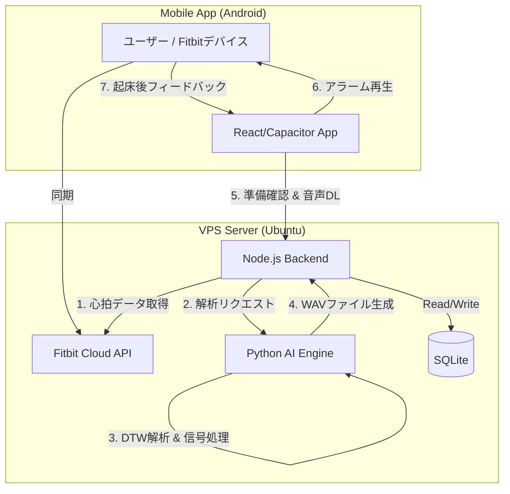

# Mixync (BioMixer)
**AI-Powered Adaptive Awakening Support System**
**生体データに基づく適応的起床支援システム**

-339933?style=flat-square&logo=node.js)
-3776AB?style=flat-square&logo=python)

---

## 📖 概要 (Overview)

**「もう、不快な目覚めは繰り返さない。」**

Mixyncは、**睡眠慣性（Sleep Inertia）** の解消を目指して開発されたスマートアラームアプリケーションです。
従来の「固定音を鳴らすだけ」のアラームとは異なり、Fitbitから取得した**リアルタイムの心拍数・睡眠深度**を解析します。

その日の自律神経の状態に合わせて、AIが**最適な音響エフェクト（トレモロ、リバーブ等）を動的に生成・合成**することで、脳を自然に覚醒状態へと導く「最高の目覚め体験」を提供します。

---

## 🚀 主な機能 (Key Features)

### 1. 適応的サウンド生成 (Adaptive Sound Synthesis)
*   **動的オーディオエンジン:** バックエンドのPythonエンジンが、DSP（デジタル信号処理）を用いて原音をリアルタイムに加工します。
*   **5つの覚醒パターン:**
    *   **Tremolo (トレモロ):** 音量を周期的に揺らし、注意を喚起する。
    *   **Auto-Pan (オートパン):** ステレオ空間を左右に移動させ、空間認知を刺激する。
    *   **Shimmer Reverb (シマーリバーブ):** 高周波倍音を付加し、クリアな覚醒感を促す。
    *   **Delay / Chorus:** リズムや音の厚みを変化させ、脳への刺激を調整する。

### 2. AIによる個別最適化 (Personalized AI Recommendation)
*   **DTW (動的時間伸縮法):** ユーザーの「現在の心拍波形」と、過去の「目覚めが良かった日の波形」を比較・照合します。
*   **継続的な学習:** 毎朝、ユーザーが「気分の良さ」を評価（0-100点）し、AIはそのフィードバックをもとにして、**そのユーザーに最も効果的な音**を学習し続けます。

### 3. IoTフルスタック統合 (Full-Stack IoT Integration)
*   **完全自動同期:** アラーム時刻の15分前にサーバーが自動起動し、Fitbitクラウドからデータを取得、起床前に音声を生成・待機させます。
*   **耐障害性設計:** 万が一API通信が失敗した場合でも、安全なデフォルト音が鳴るフェイルセーフ機構や、誤操作を防ぐ論理削除（Soft Delete）を実装しています。

---

## 🛠 技術構成 (Tech Stack)

モバイルアプリ・バックエンド・AI解析・インフラ構築までを一貫して設計・開発しました。

| カテゴリ | 使用技術 | 役割 |
| :--- | :--- | :--- |
| **Frontend** | React, Vite, Capacitor | AndroidアプリUI構築, APK生成 |
| **Backend** | Node.js (Express) | API全体統括, ジョブスケジューリング, DB管理 |
| **AI / Data** | Python (FastAPI), NumPy, SciPy | 信号処理, DTW解析, 音響合成 (Pedalboard) |
| **Database** | SQLite (Better-SQLite3) | ユーザー・計測データ・フィードバックの管理 |
| **Infrastructure** | Xserver VPS, Nginx, PM2 | リバースプロキシ, 常時SSL化, プロセス管理 |

---

## 🏗 システムアーキテクチャ

マイクロサービスライクな構成を採用し、Node.jsをオーケストレーターとして、Pythonの計算資源と連携させています。

---

## 🧪 アルゴリズムの工夫

**なぜ DTW (Dynamic Time Warping) なのか？**
単純な「平均心拍数」の比較では、睡眠中の微妙な変化（ピークのタイミングや変動の形）を捉えきれません。
本システムでは、時系列データの形状類似度を測る **DTW（動的時間伸縮法）** を採用することで、波形の「時間的なズレ」を許容しつつ、最適な過去の成功パターンを見つけ出します。これにより、ユーザーごとの睡眠特性に深くパーソナライズされた提案が可能になりました。

---

## 👨‍💻 開発者 (Developer)

**駒澤 広夢 (Hiromu Komazawa)**
*   **担当領域:** フルスタック開発, アルゴリズム設計, インフラ構築
*   **専門/関心:** Human-Computer Interaction (HCI), IoT, Wellness Tech

---

&copy; 2024-2025 Mixync Project.
